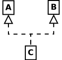

<section id="themes">
	<h2>Themes</h2>
		<p>
			Set your presentation theme: <br>
			<!-- Hacks to swap themes after the page has loaded. Not flexible and only intended for the reveal.js demo deck. -->
                        <a href="#" onclick="document.getElementById('theme').setAttribute('href','css/theme/black.css'); return false;">Black (default)</a> -
			<a href="#" onclick="document.getElementById('theme').setAttribute('href','css/theme/white.css'); return false;">White</a> -
			<a href="#" onclick="document.getElementById('theme').setAttribute('href','css/theme/league.css'); return false;">League</a> -
			<a href="#" onclick="document.getElementById('theme').setAttribute('href','css/theme/sky.css'); return false;">Sky</a> -
			<a href="#" onclick="document.getElementById('theme').setAttribute('href','css/theme/beige.css'); return false;">Beige</a> -
			<a href="#" onclick="document.getElementById('theme').setAttribute('href','css/theme/simple.css'); return false;">Simple</a> <br>
			<a href="#" onclick="document.getElementById('theme').setAttribute('href','css/theme/serif.css'); return false;">Serif</a> -
			<a href="#" onclick="document.getElementById('theme').setAttribute('href','css/theme/blood.css'); return false;">Blood</a> -
			<a href="#" onclick="document.getElementById('theme').setAttribute('href','css/theme/night.css'); return false;">Night</a> -
			<a href="#" onclick="document.getElementById('theme').setAttribute('href','css/theme/moon.css'); return false;">Moon</a> -
			<a href="#" onclick="document.getElementById('theme').setAttribute('href','css/theme/solarized.css'); return false;">Solarized</a>
		</p>
</section>

H:

# Inheritance & Polymorphism

by Jean Pierre Charalambos  
[Universidad Nacional de Colombia](https://unal.edu.co/)

H:

# Index

 1. Introduction <!-- .element: class="fragment" data-fragment-index="1"-->
 1. Inheritance <!-- .element: class="fragment" data-fragment-index="2"-->
 1. Polymorphism <!-- .element: class="fragment" data-fragment-index="3"-->
 1. Workshop <!-- .element: class="fragment" data-fragment-index="4"-->
 1. References <!-- .element: class="fragment" data-fragment-index="5"-->
 
H:

## Introduction

We already know:

<li class="fragment"> An object is a _data structure_ for storing user-defined _attributes_ (which may be other objects even of the same type), and _methods_ to manipulate them
<li class="fragment"> To use an object: Declare & initialize it and then call functions on it

V:

## Introduction

We may ask now for ways to relate objects different than [composition](https://en.wikipedia.org/wiki/Object_composition), also referred to as a [has-a relationship](https://en.wikipedia.org/wiki/Has-a)

> That's where Inheritance & Polymorphism comes into the picture

H:

## Inheritance
What is?

> "The mechanism by which more-specific elements incorporate the structure and behavior of more-general elements" (Booch, Rumbaugh, & Jacobson, 2005, p. 456)

<li class="fragment"> One class defines some members (attributes and methods) and the other class inherits and may re-use them
<li class="fragment"> Also referred to as a [is-a relationship](https://en.wikipedia.org/wiki/Is-a)

V:

## Inheritance
We say:

<li class="fragment"> B is _subclass_ of A (often written as $B <: A$)
<li class="fragment"> A is _superclass_ of B
<li class="fragment"> A and B form a _class hierarchy_

V:

## Inheritance

<figure>
    
    <figcaption>Single inheritance</figcaption>
</figure>

V:

## Inheritance

<figure>
    
    <figcaption>Multiple inheritance</figcaption>
</figure>

V:

## Inheritance

<figure>
    
    <figcaption>Multilevel inheritance</figcaption>
</figure>

V:

## Inheritance
Advantages

<li class="fragment"> It is a mechanism for code reuse
<li class="fragment"> It allows (independent) extensions of the original software via public classes and interfaces

V:

## Inheritance
Example:

> Consider the problem of implementing the following class hierarchy:
> Rect<:Shape, Term<:Shape, which (in part) may be useful for the Tangram game

V:

## Inheritance
Example

```processing
// Superclass Shape
class Shape {
  float _rotation;
  float _scaling;
  PVector _position;
  color _hue;

  Shape() {
    setPosition(new PVector(random(0, width), random(0, height)));
    setRotation(random(0, TWO_PI));
    setScaling(random(0.5, 1.5));
    setHue(color(random(0, 255), random(0, 255), random(0, 255)));
  }
  
  // setters & getters

  float scaling() {
    return _scaling;
  }

  void setScaling(float scaling) {
    _scaling = scaling;
  }

  float rotation() {
    return _rotation;
  }

  void setRotation(float rotation) {
    _rotation = rotation;
  }

  PVector position() {
    return _position;
  }

  void setPosition(PVector position) {
    _position = position;
  }

  color hue() {
    return _hue;
  }

  void setHue(color hue) {
    _hue = hue;
  }
}
```

V:

## Inheritance
Example

```processing
// Subclass Rect
class Rect extends Shape {
  float _edge;

  Rect() {
    setEdge(100);
  }
  
  void draw() {
    push();
    fill(hue());
    translate(position().x, position().y);
    rotate(rotation());
    scale(scaling(), scaling());
    rectMode(CENTER);
    rect(0, 0, edge(), edge());
    pop();
  }

  public float edge() {
    return _edge;
  }

  public void setEdge(float edge) {
    _edge = edge;
  }
}
```

V:

## Inheritance
Example

```processing
// Subclass Term
class Term extends Shape {
  String _elements;

  Term() {
    setElements("Hola mundo");
  }
  
  void draw() {
    push();
    fill(hue());
    translate(position().x, position().y);
    rotate(rotation());
    scale(scaling(), scaling());
    noStroke();
    text(_elements, 0, 0);
    pop();
  }

  String elements() {
    return _elements;
  }

  void setElements(String elements) {
    _elements = elements;
  }
}
```

V:

## Inheritance
Example

```processing
// Object declaration
Rect rect;
Term term;

void setup() {
  size(800, 800);
  // Object instantiation:
  rect = new Rect();
  term = new Term();
  // Object use:
  rect.setHue(color(255,0,0));
  term.setHue(color(0,255,0));
}

void draw() {
  background(255, 255, 255);
  // ...
  // Object use:
  rect.draw();
  term.draw();
}

// ...
```

H:

## Polymorphism
What is?

> Functions / methods having many forms

Allows to perform a single action in different ways <!-- .element: class="fragment" data-fragment-index="1"--> 

V:

## Polymorphism
Main types

1. Ad hoc polymorphism <!-- .element: class="fragment" data-fragment-index="1"-->
2. Subtyping <!-- .element: class="fragment" data-fragment-index="3"-->

H:

## Ad hoc polymorphism

> when a function denotes different implementations depending on a limited range of individually specified types

Supported either via:
<li class="fragment"> [Function overloading](https://en.wikipedia.org/wiki/Function_overloading) (e.g., C++, Processing, java)
<li class="fragment"> [Variadic functions](https://en.wikipedia.org/wiki/Variadic_function) (e.g., C++, Processing, java, js)
<li class="fragment"> Default parameter values (js)

V:

## Ad hoc polymorphism
### Function overloading
Continuing our previous example:

```processing
// Subclass Term
class Term extends Shape {
  String _elements;

  Term() {
    this(3, 8);
  }

  // Constructor overloaded
  Term(String elements, float scaling) {
    setElements(elements);
    setScaling(scaling);
  }

  Term(int elements, float scaling) {
    setElements(elements);
    setScaling(scaling);
  }

  void draw() {
    push();
    fill(hue());
    translate(position().x, position().y);
    rotate(rotation());
    scale(scaling(), scaling());
    noStroke();
    text(_elements, 0, 0);
    pop();
  }

  String elements() {
    return _elements;
  }

  void setElements(String elements) {
    _elements = elements;
  }

  // Method overloaded
  void setElements(int elements) {
    _elements = new String();
    // see: https://discourse.processing.org/t/get-random-letters-and-put-into-a-string/28585/10
    for (int i = 0; i < elements; i++) {
      _elements += char (int(random (65, 65+24)));
    }
  }
}
```

H:

## Subtyping

> when the same method prototype is implemented by many different clases within a class hierarchy

V:

## Subtyping

Suppose B is a subtype of A

We not only say:

<li class="fragment"> B is _subclass_ of A
<li class="fragment"> A is _superclass_ of B
<li class="fragment"> A and B form a _class hierarchy_

V:

## Subtyping

but also:

any term of type B can be _safely used_ in a context where a term of type A is expected

V:

## Subtyping

Advantages:

<li class="fragment"> It encourages _data abstraction_
<li class="fragment"> It allows _code simplicity_

V:

## Subtyping

Continuing our previous example:

```processing
// Superclass Shape
abstract class Shape {
  float _rotation;
  float _scaling;
  PVector _position;
  color _hue;

  Shape() {
    this(new PVector(random(0, width), random(0, height)),
         random(0, TWO_PI),
         random(0.5, 1.5),
         color(random(0, 255), random(0, 255), random(0, 255)));
  }

  Shape(PVector position, float rotation, float scaling, color hue) {
    setPosition(position);
    setRotation(rotation);
    setScaling(scaling);
    setHue(hue);
  }

  void draw() {
    push();
    fill(hue());
    translate(position().x, position().y);
    rotate(rotation());
    scale(scaling(), scaling());
    aspect();
    pop();
  }

  // Polymorphic method
  abstract void aspect();
  
  // ...
}
```

V:

## Subtyping
Continuing our previous example:

```processing
// Subclass Rect
class Rect extends Shape {
  float _edge;

  Rect() {
    this(100);
  }

  Rect(float edge) {
    setEdge(edge);
  }

  // Polymorphic method
  @Override
  void aspect() {
    rectMode(CENTER);
    rect(0, 0, edge(), edge());
  }
}
```

V:

## Subtyping
Continuing our previous example:

```processing
// Subclass Term
class Term extends Shape {
  String _elements;

  Term() {
    this(3, 8);
  }

  Term(String elements, float scaling) {
    setElements(elements);
    setScaling(scaling);
  }

  Term(int elements, float scaling) {
    setElements(elements);
    setScaling(scaling);
  }

  // Polymorphic method
  @Override
  void aspect() {
    noStroke();
    text(_elements, 0, 0);
  }

  String elements() {
    return _elements;
  }

  void setElements(String elements) {
    _elements = elements;
  }

  void setElements(int elements) {
    _elements = new String();
    // see: https://discourse.processing.org/t/get-random-letters-and-put-into-a-string/28585/10
    for (int i = 0; i < elements; i++) {
      _elements += char (int(random (65, 65+24)));
    }
  }
}
```

V:

## Subtyping
Continuing our previous example:

```processing
// Object declaration
Shape[] shapes;
boolean drawGrid = true;

void setup() {
  size(800, 800);
  shapes = new Shape[7];
  for (int i=0; i<shapes.length; i++)
    // Object instantation
    // We cannot initialize an 'abstract object',  only 'concrete' ones:
    shapes[i] = i < 4 ? new  Rect() : new Term();
}

void draw() {
  background(255, 255, 255);
  // ...
  for (Shape shape : shapes)
    // Object use
    shape.draw();
}

// ...
```

H:

## Workshop

Use the [TangramRosetta](https://github.com/objetos/TangramRosetta) template to implement the Tangram game,
from a class hierarchy such as: Rect<:Shape, Triangle<:Shape, Paralelogram<:Shape

H:

## References

* [Inheritance](https://en.wikipedia.org/wiki/Inheritance_(object-oriented_programming)
* [Bjarne Stroustrup (February 19, 2007). "Bjarne Stroustrup's C++](http://www.stroustrup.com/glossary.html#Gpolymorphism)
* [Polymorphism](https://en.wikipedia.org/wiki/Polymorphism_(computer_science)
* [Subtyping](https://en.wikipedia.org/wiki/Subtyping)
* [TangramRosetta](https://github.com/objetos/TangramRosetta)

V:

## Further reading:

* [Multiple inheritance](https://en.wikipedia.org/wiki/Multiple_inheritance)
* [Upper type bounds](https://docs.scala-lang.org/tour/upper-type-bounds.html)
