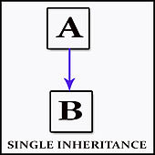

<section id="themes">
	<h2>Themes</h2>
		<p>
			Set your presentation theme: <br>
			<!-- Hacks to swap themes after the page has loaded. Not flexible and only intended for the reveal.js demo deck. -->
                        <a href="#" onclick="document.getElementById('theme').setAttribute('href','css/theme/black.css'); return false;">Black (default)</a> -
			<a href="#" onclick="document.getElementById('theme').setAttribute('href','css/theme/white.css'); return false;">White</a> -
			<a href="#" onclick="document.getElementById('theme').setAttribute('href','css/theme/league.css'); return false;">League</a> -
			<a href="#" onclick="document.getElementById('theme').setAttribute('href','css/theme/sky.css'); return false;">Sky</a> -
			<a href="#" onclick="document.getElementById('theme').setAttribute('href','css/theme/beige.css'); return false;">Beige</a> -
			<a href="#" onclick="document.getElementById('theme').setAttribute('href','css/theme/simple.css'); return false;">Simple</a> <br>
			<a href="#" onclick="document.getElementById('theme').setAttribute('href','css/theme/serif.css'); return false;">Serif</a> -
			<a href="#" onclick="document.getElementById('theme').setAttribute('href','css/theme/blood.css'); return false;">Blood</a> -
			<a href="#" onclick="document.getElementById('theme').setAttribute('href','css/theme/night.css'); return false;">Night</a> -
			<a href="#" onclick="document.getElementById('theme').setAttribute('href','css/theme/moon.css'); return false;">Moon</a> -
			<a href="#" onclick="document.getElementById('theme').setAttribute('href','css/theme/solarized.css'); return false;">Solarized</a>
		</p>
</section>

H:

# Polymorphism

by some [National University of Colombia collaborators](https://github.com/orgs/objetos/people)

H:

# Index

 1. Introduction <!-- .element: class="fragment" data-fragment-index="1"-->
 1. Inheritance <!-- .element: class="fragment" data-fragment-index="2"-->
 1. Polymorphism <!-- .element: class="fragment" data-fragment-index="3"-->
 
H:

## Introduction

We already know:

<li class="fragment"> An object is a _data structure_ for storing user-defined _attributes_ (which may be other objects even of the same type), and _methods_ to manipulate them
<li class="fragment"> To use an object: Declare & initialize it and then call functions on it

V:

## Introduction

We may ask now for ways to relate objects different than [composition](https://en.wikipedia.org/wiki/Object_composition)

> That's where Inheritance & Polymorphism comes into the picture

H:

## Inheritance
What is?

> Is when an object or class B is based on another object or class A

V:

## Inheritance
We say:

<li class="fragment"> B is _sublass_ of A
<li class="fragment"> A is _superclass_ of B
<li class="fragment"> A and B form a _class hierarchy_

V:

## Inheritance

<figure>
    
    <figcaption>Single inheritance</figcaption>
</figure>

V:

## Inheritance

<figure>
    
    <figcaption>Multiple inheritance</figcaption>
</figure>

V:

## Inheritance

<figure>
    
    <figcaption>Multilevel inheritance</figcaption>
</figure>

V:

## Inheritance
Advantages

<li class="fragment"> It is a mechanism for code reuse
<li class="fragment"> It allows (independent) extensions of the original software via public classes and interfaces

V:

## Inheritance
Example:

> Consider the problem of implmenting the following class hierarchy for the tangram game:
> Rect<:Shape, Triangle<:Shape, Paralelogram<:Shape

V:

## Inheritance
Example

```processing
// Superclass Shape
class Shape {
  float _rotation;
  float _scaling;
  PVector _position;
  color _hue;

  Shape() {
    setPosition(new PVector(random(0, width), random(0, height)));
    setRotation(random(0, TWO_PI));
    setScaling(random(0.5, 1.5));
    setHue(color(random(0, 255), random(0, 255), random(0, 255)));
  }
  
  // setters & getters

  float scaling() {
    return _scaling;
  }

  void setScaling(float scaling) {
    _scaling = scaling;
  }

  float rotation() {
    return _rotation;
  }

  void setRotation(float rotation) {
    _rotation = rotation;
  }

  PVector position() {
    return _position;
  }

  void setPosition(PVector position) {
    _position = position;
  }

  color hue() {
    return _hue;
  }

  void setHue(color hue) {
    _hue = hue;
  }
}
```

V:

## Inheritance
Example

```processing
// Subclass Rect
class Rect extends Shape {
  float _edge;

  Rect() {
    setEdge(100);
  }
  
  void draw() {
    push();
    fill(hue());
    translate(position().x, position().y);
    rotate(rotation());
    scale(scaling(), scaling());
    rectMode(CENTER);
    rect(0, 0, edge(), edge());
    pop();
  }

  public float edge() {
    return _edge;
  }

  public void setEdge(float edge) {
    _edge = edge;
  }
}
```

V:

## Inheritance
Example

```processing
// Object declaration
Rect rect;
boolean drawGrid = true;

void setup() {
  size(800, 800);
  // Object instantiation:
  rect = new Rect();
}

void drawGrid(float scale) {
  push();
  strokeWeight(1);
  int i;
  for (i=0; i<=width/scale; i++) {
    stroke(0, 0, 0, 20);
    line(i*scale, 0, i*scale, height);
  }
  for (i=0; i<=height/scale; i++) {
    stroke(0, 0, 0, 20);
    line(0, i*scale, width, i*scale);
  }
  pop();
}

void draw() {
  background(255, 255, 255);
  if (drawGrid)
    drawGrid(10);
  // Object use:
  rect.draw();
}

void keyPressed() {
  if (key == 'g' || key == 'G')
    drawGrid = !drawGrid;
}
```

H:

## Polymorphism
What is?

> is the provision of a single interface to entities of different types
[Bjarne Stroustrup (February 19, 2007). "Bjarne Stroustrup's C++](http://www.stroustrup.com/glossary.html#Gpolymorphism)

V:

## Polymorphism
Types

1. Ad hoc polymorphism <!-- .element: class="fragment" data-fragment-index="1"-->
1. Parametric polymorphism <!-- .element: class="fragment" data-fragment-index="2"-->
1. Subtyping <!-- .element: class="fragment" data-fragment-index="3"-->

H:

## Ad hoc polymorphism

> when a function denotes different implementations depending on a limited range of individually specified types

Supported in many languages via function overloading <!-- .element: class="fragment" data-fragment-index="1"-->

V:

## Function overloading
Continuing our previous example:

```processing
// Superclass Shape
class Shape {
  // ...

  Shape() {
    this(new PVector(random(0, width), random(0, height)),
         random(0, TWO_PI),
         random(0.5, 1.5),
         color(random(0, 255), random(0, 255), random(0, 255)));
  }

  Shape(PVector position, float rotation, float scaling, color hue) {
    setPosition(position);
    setRotation(rotation);
    setScaling(scaling);
    setHue(hue);
  }
  
  //...
}
```

V:

## Function overloading
Continuing our previous example:

```processing
// Subclass Rect
class Rect extends Shape {
  flo1at _edge;

  Rect() {
    this(100);
  }

  Rect(float edge) {
    setEdge(edge);
  }

  // ...
}
```


V:

## Function overloading
Continuing our previous example:

```processing
// Object declaration
Rect rect;
boolean drawGrid = true;

void setup() {
  size(800, 800);
  // Object instantiation:
  rect = new Rect(50);
}

// ...

void draw() {
  background(255, 255, 255);
  if (drawGrid)
    drawGrid(10);
  // Object use:
  rect.draw();
}

// ...
```

H:

## Parametric polymorphism

> when code is written without mention of any specific type and thus can
be used transparently with any number of new types

V:

## Parametric polymorphism

Also known as:

* [Generic programming](https://en.wikipedia.org/wiki/Generic_programming) in the OOP community
* _Polymorphism_ in the functional programming community

H:

## Subtyping

> when a name denotes instances of many different classes related by some common superclass

V:

## Subtyping

Also known as:

* _Polymorphism_ in the OOP community

V:

## Subtyping

Suppose B is a subtype of A (often written as $B <: A$)

We not only say:

<li class="fragment"> B is _sublass_ of A
<li class="fragment"> A is _superclass_ of B
<li class="fragment"> A and B form a _class hierarchy_


V:

## Subtyping

but also:

any term of type B can be _safely used_ in a context where a term of type A is expected

V:

## Subtyping

Advantages:

<li class="fragment"> It encourages _data abstraction_
<li class="fragment"> It allows _code simplicity_

V:

## Subtyping

Continuing our previous example:

```processing
// Superclass Shape
abstract class Shape {
  float _rotation;
  float _scaling;
  PVector _position;
  color _hue;

  Shape() {
    this(new PVector(random(0, width), random(0, height)),
         random(0, TWO_PI),
         random(0.5, 1.5),
         color(random(0, 255), random(0, 255), random(0, 255)));
  }

  Shape(PVector position, float rotation, float scaling, color hue) {
    setPosition(position);
    setRotation(rotation);
    setScaling(scaling);
    setHue(hue);
  }

  void draw() {
    push();
    fill(hue());
    translate(position().x, position().y);
    rotate(rotation());
    scale(scaling(), scaling());
    geom();
    pop();
  }

  abstract void geom();
  
  // ...
}
```

V:

## Subtyping
Continuing our previous example:

```processing
// Subclass Rect
class Rect extends Shape {
  float _edge;

  Rect() {
    this(100);
  }

  Rect(float edge) {
    setEdge(edge);
  }

  @Override
  void geom() {
    rectMode(CENTER);
    rect(0, 0, edge(), edge());
  }
}
```

V:

## Subtyping
Continuing our previous example:

```processing
// Object declaration
Shape[] shapes;
boolean drawGrid = true;

void setup() {
  size(800, 800);
  shapes = new Shape[7];
  for (int i=0; i<shapes.length; i++)
    // We cannot initialize an 'abstract object',  only 'concrete' ones:
    shapes[i] = new Rect();
}

void draw() {
  background(255, 255, 255);
  if (drawGrid)
    drawGrid(10);
  for (Shape shape : shapes)
    // Object use:
    shape.draw();
}

// ...
```

H:

## References

* [Inheritance](https://en.wikipedia.org/wiki/Inheritance_(object-oriented_programming)
* [Bjarne Stroustrup (February 19, 2007). "Bjarne Stroustrup's C++](http://www.stroustrup.com/glossary.html#Gpolymorphism)
* [Polymorphism](https://en.wikipedia.org/wiki/Polymorphism_(computer_science)
* [Subtyping](https://en.wikipedia.org/wiki/Subtyping)

V:

## Further reading:

* [Is-a relationship](https://en.wikipedia.org/wiki/Is-a)
* [Java Interfaces](https://en.wikipedia.org/wiki/Interface_(Java)
